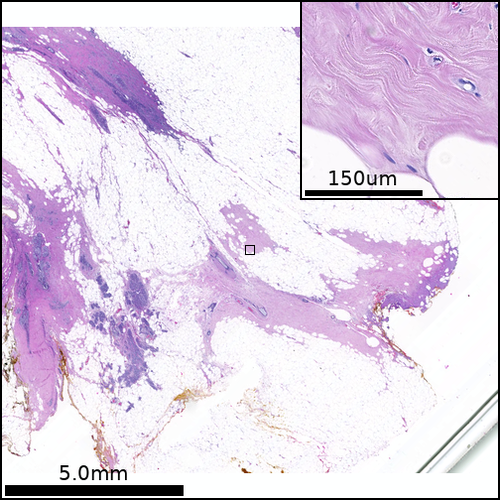
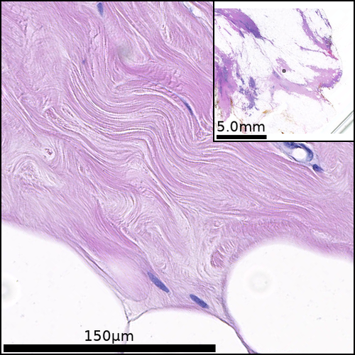

# PATHOverview
A tool for generating PATHOlogy Overview figures from whole-slide image files. This tool was developed to create easy to view multi-page multi-panel figures to see all histology slides from one sample at a time. It has since evolved!

PATHOverview rotates, crops and zooms whole slide files to generate customised images, these can then be exported as multi-panel figures.<br>

Default PATHOverview figure:<br>



Inverted PATHOverview figure:<br>


An [example output pdf](./test_files/test_output.pdf) is contained in the test_files folder. This has been generated using parameters set in slide_lists_demo.xlsx and our [interactive Jupyter notebook](pathoverview_interactive_example.ipynb). Further examples can be found in our publication linked below.<br>
Basic usage of PATHOverview is detailed in our [test notebook](pathoverview_basic_use.ipynb). Whole slide files can be listed (and NDPA annotation read) using [PATHOverview_list_files.ipynb](pathoverview_list_files.ipynb). An [interactive Jupyter notebook](pathoverview_interactive_example.ipynb) is provided for setting crop parameters for each slide.<br>

PATHOverview uses OpenSlide ([openslide.org](http://openslide.org)) and its python bindings to access virtual slide images. PATHOverview has been tested on Hamamatsu Nanozoomer NDPI images. The example notebooks require freely available ndpi images [OS-1.ndpi](https://openslide.cs.cmu.edu/download/openslide-testdata/Hamamatsu/) and [OS-2.ndpi](https://openslide.cs.cmu.edu/download/openslide-testdata/Hamamatsu/) from OpenSlide which should be placed in the /test_files folder.<br>

This tool was developed to present immunohistochemistry images from Hamamatsu Nanozoomer ndpi virtual slide files in our publication below. Please cite this repository and our publication if this tool has been of use.<br>


**Phenotyping of lymphoproliferative tumours generated in xenografts of non-small cell lung cancer.**<br>
David R. Pearce, Ayse U. Akarca, Roel P. H. De Maeyer, Emily Kostina, Ariana Huebner, Monica Sivakumar, Takahiro Karasaki, Kavina Shah, Sam M. Janes, Nicholas McGranahan, Venkat Reddy, Arne N. Akbar, David A. Moore, Teresa Marafioti, Charles Swanton and Robert E. Hynds<br>
https://www.frontiersin.org/articles/10.3389/fonc.2023.1156743/full<br>
Frontiers in Oncology 2023; doi: https://doi.org/10.3389/fonc.2023.1156743<br>
bioRxiv 2023.01.24.520089; doi: https://doi.org/10.1101/2023.01.24.520089

## Getting started & running examples
#### Outline
- Download this repository
- Install JupyterLab Desktop
- In JupyterLab: install the required python packages including the openslide-python bindings and OpenSlide binaries
- Open pathoverview_basic_use.ipynb
- Run the example notebook

#### Requirements
PATHOverview uses OpenSlide to read whole slide images. OpenSlide is installed in two components: the OpenSlide program and openslide-python bindings.

PATHOverview requires OpenSlide and the following python packages: <br>
openslide-python, pillow, openpyxl, matplotlib, pandas, jupyterlab, ipywidgets, ipympl<br>


#### Installation

**Recomended: Jupyter Lab Desktop**<br>
- Download a zip of the PATHOverview repository and extract to a working folder<br>
- Add the OpenSlide example files [OS-1.ndpi](https://openslide.cs.cmu.edu/download/openslide-testdata/Hamamatsu/) and [OS-2.ndpi](https://openslide.cs.cmu.edu/download/openslide-testdata/Hamamatsu/) to the /test_files folder
- Install Jupyter Lab Desktop application from:
https://github.com/jupyterlab/jupyterlab-desktop/releases
- Run Jupyter Lab Desktop and open a terminal in the program
- Install required packages with pip from within Jupyter Lab:
```
pip install openslide-python openslide-bin pillow openpyxl matplotlib pandas jupyterlab ipywidgets ipympl
```
- Open and Run [pathoverview_basic_use.ipynb](pathoverview_basic_use.ipynb) to test your installation and for a working example of PATHOverview image extraction
- Open and Run [pathoverview_interactive_example.ipynb](pathoverview_interactive_example.ipynb) for an example interactive figure used to set slide crop parameters


### To do:
- [x] Add inverted figure of zoom image with inset overview
- [x] Draw parameters from slide_df on interactive figure where already set
- [x] Add white balance
- [x] Read parameters from NDPA files to enable more accurate zoom etc.
- [ ] Check compatability with other slide formats
- [ ] assess improvements to memory usage and speed
